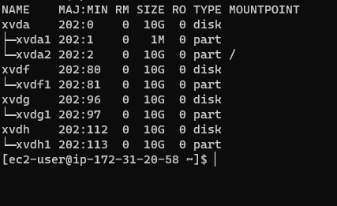
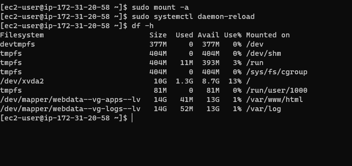
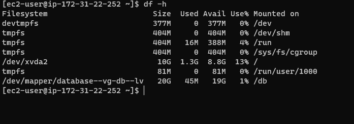
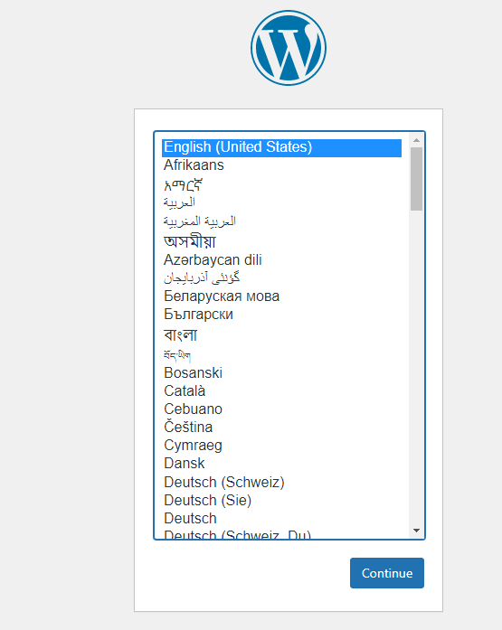
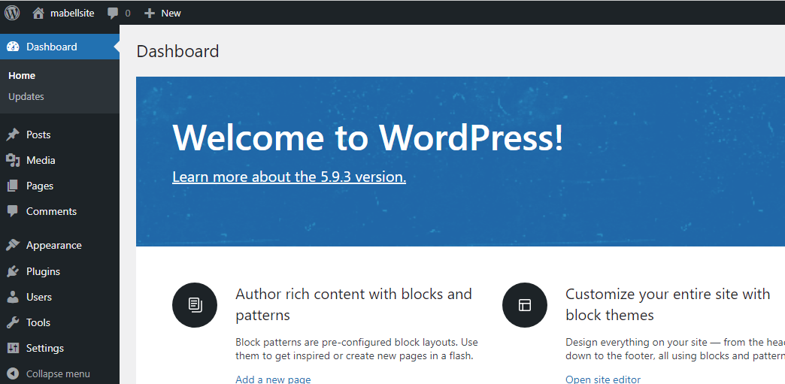

# **WEB SOLUTION WITH WORDPRESS**
### PREPARE A WEBSERVER
> Launch an EC2 instance that will serve as "Web Server". Create 3 volumes in the same AZ as your Web Server EC2, each of 10 GiB and the attach these volumes to your ec2 webserver.
Lock into your ec2 webserver and begin the configuration.
```Bash
lsblk
df -h
sudo gdisk /dev/device_name
```


> Install lvm2 package and check for available partitions
```Bash
sudo yum install lvm2
sudo lvmdiskscan
```
> Covert all 3 disks to physical volumes so it can be used by lvm.
```Bash
sudo pvcreate /dev/xvdf1
sudo pvcreate /dev/xvdg1
sudo pvcreate /dev/xvdh1
```
> Use vgcreate utility to add all 3 PVs to a volume group (VG). Name the VG webdata-vg.

`sudo vgcreate webdata-vg /dev/xvdh1 /dev/xvdg1 /dev/xvdf1`
> Use lvcreate utility to create 2 logical volumes

`sudo lvcreate -n apps-lv -L 14G webdata-vg`

`sudo lvcreate -n logs-lv -L 14G webdata-vg`

> Format the logical volumes into ext4 file system

`sudo mkfs -t ext4 /dev/webdata-vg/apps-lv`

`sudo mkfs -t ext4 /dev/webdata-vg/logs-lv`

> Create /var/www/html directory(mountpoint) to store website files

`sudo mkdir -p /var/www/html`

> Create /home/recovery/logs to store backup of log data

`sudo mkdir -p /home/recovery/logs`
> Mount /var/www/html on apps-lv logical volume

`sudo mount /dev/webdata-vg/apps-lv /var/www/html/`
> Use rsync utility to backup all the files in the log directory /var/log into /home/recovery/logs

`sudo rsync -av /var/log/. /home/recovery/logs/`
> Mount /var/log on logs-lv logical volume. (Note that all the existing data on /var/log will be deleted

`sudo mount /dev/webdata-vg/logs-lv /var/log`
> Restore log files back into /var/log directory

`sudo rsync -av /home/recovery/logs/. /var/log`
> Update /etc/fstab file so that the mount configuration will persist after restart of the server

```Bash
sudo blkid
vi /etc/fstab
```
> Test the configuration, reload the daemon and then verify your setup.
```Bash
sudo mount -a
sudo systemctl daemon-reload
df -h
```


## PREPARE A DATABASE SERVER
> Repeat the same steps as for the Web Server, but instead of apps-lv create db-lv and mount it to /db directory instead of /var/www/html/.
> You should have the following final result.


## INSTALL WORDPRESS ON YOUR WEBSERVER
> Update the repository,Install wget, Apache, php and it’s dependencies

`sudo yum -y update`

`sudo yum -y install wget httpd php php-mysqlnd php-fpm php-json`
> start apache

`sudo systemctl enable httpd`

`sudo systemctl start httpd`
> Install the latest version of php and it's dependencies
```Bash
sudo yum install https://dl.fedoraproject.org/pub/epel/epel-release-latest-8.noarch.rpm
sudo yum install yum-utils http://rpms.remirepo.net/enterprise/remi-release-8.rpm
sudo yum module list php
sudo yum module reset php
sudo yum module enable php:remi-7.4
sudo yum install php php-opcache php-gd php-curl php-mysqlnd
sudo systemctl start php-fpm
sudo systemctl enable php-fpm
setsebool -P httpd_execmem 1
```
> Restart Apache

`sudo systemctl restart httpd`
> Download wordpress and copy wordpress to var/www/html
```Bash
mkdir wordpress
  cd   wordpress
  sudo wget http://wordpress.org/latest.tar.gz
  sudo tar xzvf latest.tar.gz
  sudo rm -rf latest.tar.gz
  cp wordpress/wp-config-sample.php wordpress/wp-config.php
  cp -R wordpress /var/www/html/
```
> Configure SELinux Policies
```Bash
sudo chown -R apache:apache /var/www/html/wordpress
sudo chcon -t httpd_sys_rw_content_t /var/www/html/wordpress -R
sudo setsebool -P httpd_can_network_connect=1
```

## INSTALL MYSQL ON THE DB SERVER
```Bash
sudo yum update
sudo yum install mysql-serve
sudo systemctl restart mysqld
sudo systemctl enable mysqld
```
## CONFIGURE THE DATABASE TO WORK WITH WORDPRESS
```mysql
sudo mysql
CREATE DATABASE wordpress;
CREATE USER `myuser`@`<Web-Server-Private-IP-Address>` IDENTIFIED BY 'mypass';
GRANT ALL ON wordpress.* TO 'myuser'@'<Web-Server-Private-IP-Address>';
FLUSH PRIVILEGES;
SHOW DATABASES;
exit
```
## CONFIGURE WORDPRESS TO CONNECT TO REMOTE DATABASE
> Install MySQL client and test that you can connect from your Web Server to your DB server by using mysql-client
```Bash
sudo mysql -u admin -p -h <DB-Server-Private-IP-address>
SHOW DATABASES
```
> Change permissions and configuration so Apache could use WordPress

`sudo setsebool -P httpd_can_network_connect_db 1`

> Enable TCP port 80 in Inbound Rules configuration for your Web Server EC2 (enable from everywhere 0.0.0.0/0 or from your workstation’s IP)
> Try to access from your browser the link to your WordPress http://<Web-Server-Public-IP-Address>/wordpress/. You should get the following results.




